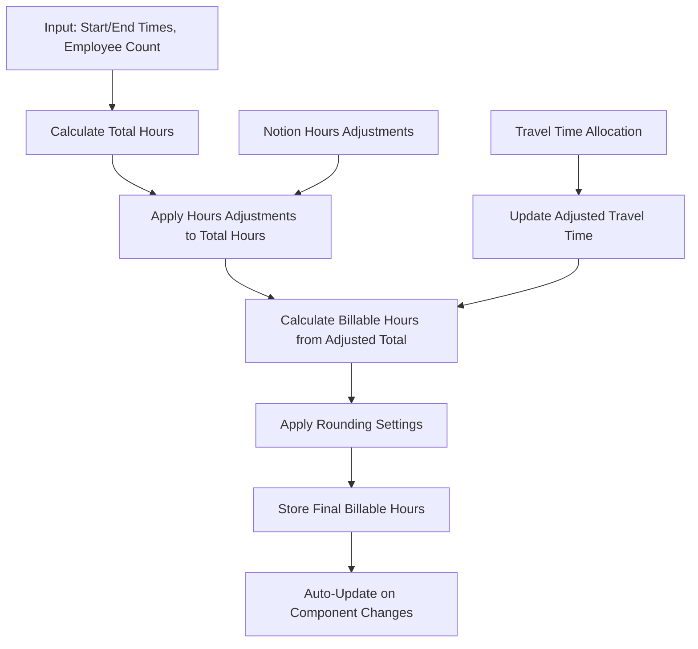

# Billable Hours Calculation System

This document describes how billable hours are calculated and modified throughout the Blossom & Bough scheduling assistant system.

**Last Updated:** 2025-01-19  
**Version:** 1.3

## Core Formula

The billable hours calculation formula used throughout the system:

```
# Step 1: Apply hours adjustments to total hours
adjustedTotalHours = totalHours + hoursAdjustments

# Step 2: Calculate billable hours from adjusted total hours
billableHours = adjustedTotalHours 
                - (nonBillableTimeMinutes / 60) 
                + (adjustedTravelTimeMinutes / 60)
```

### Key Components

| Component | Description | Impact |
|-----------|-------------|---------|
| `totalHours` | Base work time (duration × employee count) | ➕ Starting point for calculation |
| `hoursAdjustments` | Person-specific adjustments from Notion | ➕/➖ Applied to total hours first |
| `adjustedTotalHours` | Total hours + hours adjustments | ➕ Base for billable calculation |
| `breakTimeMinutes` | Lunch/break time | ✅ **Billable time** (not subtracted) |
| `adjustedBreakTimeMinutes` | Allocated break time | ✅ **Billable time** (not subtracted) |
| `nonBillableTimeMinutes` | Non-billable activities | ➖ Subtracted from adjusted total |
| `adjustedTravelTimeMinutes` | Allocated travel time | ➕ Added to billable hours |

**Important Notes:**
- Raw `travelTimeMinutes` is stored for reference but **NOT** used in billable hours calculation
- **Break time is billable** - only non-billable activities are subtracted from total hours

## When Billable Hours Are Calculated

### 1. New Work Activity Creation

**Service:** `WorkActivityService.createWorkActivity()`  
**File:** `/server/src/services/WorkActivityService.ts` (lines 276-375)

**Logic:**
- If `billableHours` provided directly: uses that value + applies rounding
- If missing but `totalHours` exists: calculates using the formula
- Always applies rounding settings if enabled

### 2. Work Activity Updates

**Service:** `WorkActivityService.updateWorkActivity()`  
**File:** `/server/src/services/WorkActivityService.ts` (lines 400-484)

**Triggers:** Billable hours are automatically recalculated when any of these fields change:
- `totalHours`
- `breakTimeMinutes`
- `nonBillableTimeMinutes`
- `adjustedTravelTimeMinutes`

### 3. Notion Sync Operations

**Services:** `NotionSyncService`, `WorkNotesParserService`  
**Files:** 
- `/server/src/services/NotionSyncService.ts`
- `/server/src/services/WorkNotesParserService.ts`

**Process:**
1. Calculate total hours from start/end times if missing
2. Apply billable hours formula including hours adjustments
3. Used for both new imports and updates from Notion

### 4. Travel Time Allocation

**Service:** `TravelTimeAllocationService`  
**File:** `/server/src/services/TravelTimeAllocationService.ts`

**Process:**
1. Calculates proportional travel time allocation across work activities for a day
2. Updates `adjustedTravelTimeMinutes` based on billable hours proportion
3. Triggers automatic billable hours recalculation when `adjustedTravelTimeMinutes` changes

## Factors That Influence Billable Hours

### Direct Factors (used in calculation)
- ✅ `totalHours` - base work time
- ✅ `breakTimeMinutes` - lunch/break time (**billable** - not subtracted)
- ✅ `adjustedBreakTimeMinutes` - allocated break time (**billable** - not subtracted)
- ✅ `nonBillableTimeMinutes` - non-billable activities (subtracted)
- ✅ `adjustedTravelTimeMinutes` - allocated travel time (added)
- ✅ `hoursAdjustments` - person-specific adjustments from Notion (added/subtracted)

### Indirect Factors
- ✅ **Rounding settings** - can round to nearest half-hour increments
- ✅ **Travel time allocation** - modifies `adjustedTravelTimeMinutes`
- ✅ **Break time allocation** - modifies `adjustedBreakTimeMinutes`
- ✅ **Employee count** - affects total hours calculation from start/end times

### Factors That DON'T Affect Billable Hours
- ❌ Raw `travelTimeMinutes` (stored but not used in calculation)
- ❌ Employee hourly rates
- ❌ Client information
- ❌ Work activity status

## Rounding System

**Service:** `SettingsService`  
**File:** `/server/src/services/SettingsService.ts`

### Configuration Settings
- `billable_hours_rounding`: enable/disable (default: false)
- `billable_hours_rounding_method`: "up", "down", or "nearest" (default: "up")

### When Applied
- Every time billable hours are calculated or updated
- Can be applied retroactively to existing work activities
- Rounds to nearest half-hour increments (0.5)

### Methods
- `roundHours()`: Apply rounding to a single value
- `applyRoundingToExistingWorkActivities()`: Bulk update existing records
- `previewRoundingForExistingWorkActivities()`: Preview changes without applying

## Hours Adjustments (Notion Integration)

**Added:** 2025-01-19 (Hours Adjustments feature)

### Format
Hours adjustments are parsed from Notion "Hours Adjustments" tables with columns:
- **Person**: Employee name (e.g., "Andrea", "Virginia")
- **Adjustment**: Time in H:MM format (e.g., "2:25", "-0:30")
- **Notes**: Reason for adjustment (e.g., "stayed late after team left")

### Parsing
- Positive adjustments: "2:25" = +2.42 hours
- Negative adjustments: "-0:30" = -0.5 hours
- Integrated into AI parsing prompts and natural text conversion

## Database Schema

**File:** `/server/src/db/schema.ts` (lines 56-79)

### Key Fields in `work_activities` table
```sql
billableHours REAL,              -- Calculated value
totalHours REAL,                 -- Input value (duration × employees)
travelTimeMinutes INTEGER,       -- Stored but NOT subtracted
adjustedTravelTimeMinutes INTEGER, -- Affects billable hours
breakTimeMinutes INTEGER,        -- Subtracted from billable hours
nonBillableTimeMinutes INTEGER,  -- Subtracted from billable hours
lastUpdatedBy TEXT              -- Tracks update source ('web_app' | 'notion_sync')
```

## Services That Modify Billable Hours

| Service | Purpose | File Location |
|---------|---------|---------------|
| `WorkActivityService` | Core CRUD operations with automatic recalculation | `/server/src/services/WorkActivityService.ts` |
| `NotionSyncService` | Imports and syncs from Notion | `/server/src/services/NotionSyncService.ts` |
| `WorkNotesParserService` | Parses and imports work notes | `/server/src/services/WorkNotesParserService.ts` |
| `TravelTimeAllocationService` | Allocates travel time across activities | `/server/src/services/TravelTimeAllocationService.ts` |
| `SettingsService` | Applies rounding rules | `/server/src/services/SettingsService.ts` |

## Data Flow Summary



1. **Input:** Start/end times, employee count, break time, non-billable time, hours adjustments
2. **Calculate:** Total hours = (duration × employee count)
3. **Apply:** Hours adjustments to total hours (adjustedTotalHours = totalHours + hoursAdjustments)
4. **Calculate:** Billable hours from adjusted total hours (breaks are billable, only non-billable time subtracted)
5. **Apply:** Rounding settings if enabled
6. **Store:** Final billable hours value
7. **Auto-update:** Recalculation triggered when component values change

## API Endpoints That Affect Billable Hours

### Direct Modifications
- `POST /api/work-activities` - Creates new work activity (automatic calculation)
- `PUT /api/work-activities/:id` - Updates work activity (automatic recalculation)

### Indirect Modifications
- Travel time allocation endpoints - Trigger travel time reallocation
- Notion sync endpoints - Import/update from Notion with hours adjustments
- Settings endpoints - Apply/modify rounding rules

## Troubleshooting

### Common Issues

**Q: Billable hours don't match expected calculation**
- ✅ Check if rounding is enabled in settings
- ✅ Verify `adjustedTravelTimeMinutes` vs raw `travelTimeMinutes`
- ✅ Look for hours adjustments from Notion sync

**Q: Travel time not affecting billable hours**
- ✅ Ensure travel time allocation has been run for that day
- ✅ Check `adjustedTravelTimeMinutes` field (not `travelTimeMinutes`)

**Q: Hours adjustments not applying**
- ✅ Verify Notion "Hours Adjustments" table format
- ✅ Check time format (H:MM or -H:MM)
- ✅ Ensure Notion sync has been run after adding adjustments

## Change Log

### Version 1.3 (2025-01-19)
- **INTEGRATION:** Merged break time allocation feature from main branch
- Added `adjustedBreakTimeMinutes` field support 
- Maintained billable break time logic during conflict resolution
- Updated documentation to include new break time allocation system

### Version 1.2 (2025-01-19)
- **IMPORTANT FIX:** Break time is now correctly treated as billable time
- Removed break time subtraction from billable hours calculation
- Updated formula to only subtract non-billable time
- Updated all three services: WorkActivityService, NotionSyncService, WorkNotesParserService

### Version 1.1 (2025-01-19)
- **IMPORTANT FIX:** Corrected hours adjustments to modify total hours instead of billable hours directly
- Updated formula to show two-step process: totalHours → adjustedTotalHours → billableHours
- Updated data flow diagram and process steps
- Corrected documentation to reflect proper calculation logic

### Version 1.0 (2025-01-19)
- Initial documentation
- Added hours adjustments support
- Documented complete billable hours lifecycle
- Added troubleshooting section

---

**Note:** This document should be updated whenever the billable hours calculation logic changes. Key areas to watch for changes:
- Formula modifications in `calculateBillableHours()` methods
- New factors that influence billable hours
- Changes to rounding logic
- New integration points (similar to Notion hours adjustments)